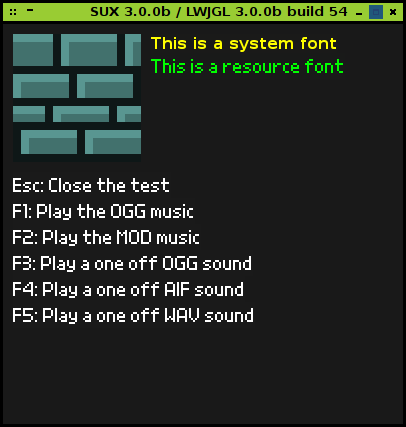

# slick-util

This is a work in progress implementation of [slick-util] for [LWJGL3].

Screenshot:

**NOTE: ninjacave now provides a [slick-util3] wrapper which probably works much better than my implementation. If you are interested in slick-util for LWJGL3 you should definitely check out the ninjacave wrapper fisrt.**

---

## License

Copyright (c) 2014, Robert Calvert   
Copyright (c) 2013, Slick2D

See the license file for license rights and limitations (MIT).

[slick-util]:http://slick.ninjacave.com/
[LWJGL3]:http://www.lwjgl.org/
[slick-util3]:http://forum.lwjgl.org/index.php?topic=4800.msg29603#msg29603
